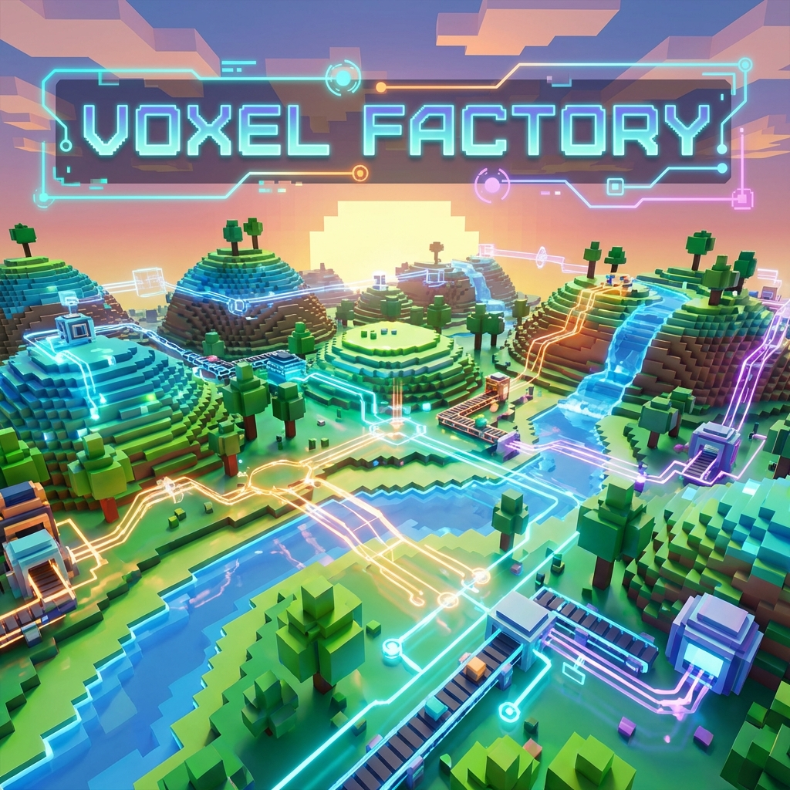
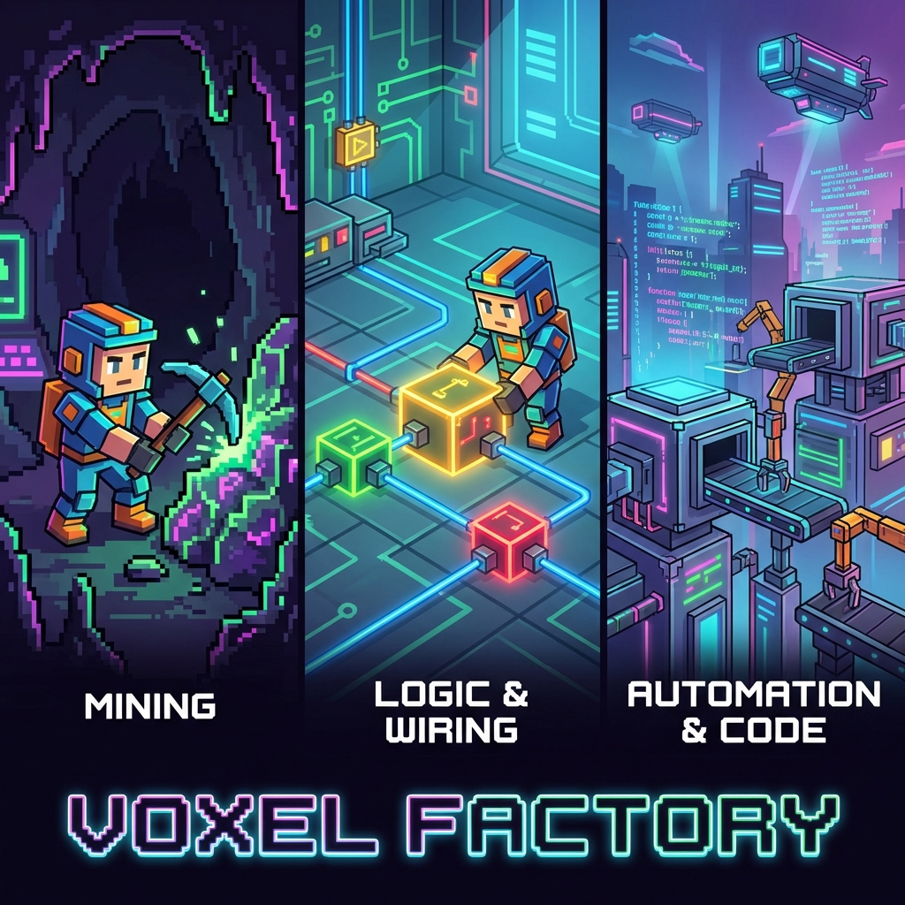

# Voxel Factory 2D



**Voxel Factory 2D** is a 2D side-scrolling sandbox game built with Godot 4.6 that bridges the gap between creative building and logical thinking.

Starting as a familiar block-building and mining experience, the game gradually introduces concepts of logic, automation, and programming. It is designed to teach programming concepts through gameplay mechanics, leading players from manual labor to mastering automated systems.

## 🎮 The Journey


*From simple tools to complex automation systems.*

1.  **Explore & Mine**: Gather resources in a procedurally generated infinite 2D world.
2.  **Build & Craft**: Create structures, storage, and initial production lines.
3.  **Graph & Logic**: Connect components using visual programming blocks.
4.  **Program & Automate**: Deploy programmable entities (Miners, Conveyors) and write graphs to control your factory.

## 📚 Documentation

Comprehensive documentation is available in the **[docs](docs/README.md)** directory:

- **[Gameplay Guide](docs/gameplay.md)** - Your first steps in Voxel Factory 2D
- **[Controls](docs/controls.md)** - Key bindings and input reference
- **[Architecture Overview](docs/architecture.md)** - High-level system design and data flow
- **[ECS Design Guide](docs/ecs-design.md)** - Deep dive into Entity-Component-System patterns and best practices
- **[Development Roadmap](docs/ROADMAP.md)** - Project milestones, feature timeline, and development tasks
- **[Content Creation](docs/content_creation.md)** - How to add new blocks, items, and entities
- **[API Reference](docs/api_reference.md)** - Detailed class and method documentation

**Project Management**: [Conductor Index](conductor/index.md) - Active tracks, product definition, and workflow.

## ✨ Features

*   **Infinite 2D World**: Procedurally generated world with diverse biomes like Plains, Forest, Desert, Mountains, and Oceans.
*   **ECS-Driven Architecture**: A lightweight Entity-Component-System implementation ensures efficient game logic and state management.
*   **Visual Programming**: Create automation using a node-based graph system with Command Blocks.
*   **Programmable Units**: Deploy autonomous Miners and helpers that follow your custom instructions.
*   **Automated Logistics**: Build conveyor belt systems to transport and process items.
*   **Pocket Dimensions**: Expand your reach into parallel dimensions for specialized factory builds.
*   **Developed with Quality**: 460+ unit and integration tests covering world gen, inventory, and system logic.

## 🚀 Getting Started

1.  **Godot 4.6 (Forward Plus)**: This project is built using Godot 4.6 (it uses Jolt Physics for 3D elements in a 2D world).
2.  **Clone the Repo**:
    ```bash
    git clone https://github.com/Snoot-Booper-Labs/Voxel-factory-2D.git
    ```
3.  **Import**: Open the `game/` folder in the Godot Editor.
4.  **Play**: Open `scenes/main.tscn` and hit F5!

## 🤝 Contributing

We welcome contributions! Whether you're a game designer, educator, or coder, Voxel Factory 2D has room for you.

*   Check out the [Architecture Documentation](docs/architecture.md).
*   Join the discussion on [GitHub Issues](https://github.com/Snoot-Booper-Labs/Voxel-factory-2D/issues).

---
*Voxel Factory 2D is a Snoot Booper Labs production.*
