# Voxel Factory 2D - Documentation

Welcome to the Voxel Factory 2D documentation. This is your comprehensive resource for understanding, playing, and developing the game.

**Project Management:** [Project Conductor Index](../conductor/index.md) - Project planning, tracks, and workflow.

---

## Getting Started

New to Voxel Factory 2D? Start here:

1. **[Gameplay Guide](./gameplay.md)** - Learn how to play, mine, build, and automate
2. **[Controls & Input](./controls.md)** - Master the keyboard and mouse controls
3. **[Architecture Overview](./architecture.md)** - Understand the high-level system design

---

## For Players

- **[Gameplay Guide](./gameplay.md)** - Tutorial, game mechanics, and strategies
- **[Controls](./controls.md)** - Complete input reference

---

## For Developers

### Essential Reading

- **[Architecture Overview](./architecture.md)** - System design, components, and data flow
- **[ECS Design Guide](./ecs-design.md)** - Deep dive into Entity-Component-System patterns
- **[Development Roadmap](./ROADMAP.md)** - Project milestones and feature timeline

### Reference & Guides

- **[API Reference](./api_reference.md)** - Detailed class and method documentation
- **[Content Creation](./content_creation.md)** - How to add new blocks, items, and entities

### Understanding the Codebase

```mermaid
graph TB
    Start[New Developer] --> Arch[Read Architecture Overview]
    Arch --> ECS[Study ECS Design Guide]
    ECS --> Code{What to build?}
    
    Code -->|New Component/Entity| Content[Content Creation Guide]
    Code -->|Fix Bug| API[API Reference]
    Code -->|New Feature| Roadmap[Development Roadmap]
    
    Content --> Build[Start Building]
    API --> Build
    Roadmap --> Build
    
    Build --> Test[Write Tests]
    Test --> PR[Submit PR]
```

---

## Documentation Structure

| Document | Purpose | Audience |
|----------|---------|----------|
| [gameplay.md](./gameplay.md) | How to play the game | Players |
| [controls.md](./controls.md) | Input reference | Players |
| [architecture.md](./architecture.md) | High-level system design | Developers |
| [ecs-design.md](./ecs-design.md) | ECS patterns and best practices | Developers |
| [ROADMAP.md](./ROADMAP.md) | Development timeline and tasks | Contributors |
| [api_reference.md](./api_reference.md) | Class/method documentation | Developers |
| [content_creation.md](./content_creation.md) | Adding game content | Modders/Contributors |

---

## Quick Links

### Common Tasks

- **Add a new block type** → [Content Creation - Blocks](./content_creation.md#adding-new-blocks)
- **Create a new entity** → [ECS Design - Examples](./ecs-design.md#example-2-creating-a-new-entity)
- **Understand component lifecycle** → [ECS Design - Lifecycle](./ecs-design.md#component-lifecycle)
- **Check roadmap progress** → [Development Roadmap](./ROADMAP.md)
- **Report a bug** → [GitHub Issues](https://github.com/Snoot-Booper-Labs/Voxel-factory-2D/issues)

### Key Concepts

- **What is ECS?** → [ECS Design - Introduction](./ecs-design.md#introduction)
- **How does world generation work?** → [Architecture - World Generation](./architecture.md#world-generation)
- **How does visual programming work?** → [Architecture - Visual Programming](./architecture.md#visual-programming-system)
- **What are the current milestones?** → [Roadmap - Overview](./ROADMAP.md#roadmap-overview)

---

## Contributing

We welcome contributions! Here's how to get started:

1. **Read the Documentation**: Familiarize yourself with the architecture and ECS design
2. **Check the Roadmap**: Find tasks that interest you in the [Development Roadmap](./ROADMAP.md)
3. **Review Active Tracks**: See what's in progress in [Conductor Tracks](../conductor/tracks.md)
4. **Write Tests**: All code changes should include tests
5. **Submit PR**: Follow the project workflow in [Conductor Workflow](../conductor/workflow.md)

---

## Support & Community

- **Issues**: [GitHub Issues](https://github.com/Snoot-Booper-Labs/Voxel-factory-2D/issues)
- **Discussions**: [GitHub Discussions](https://github.com/Snoot-Booper-Labs/Voxel-factory-2D/discussions)

---

*Voxel Factory 2D is a Snoot Booper Labs production.*
