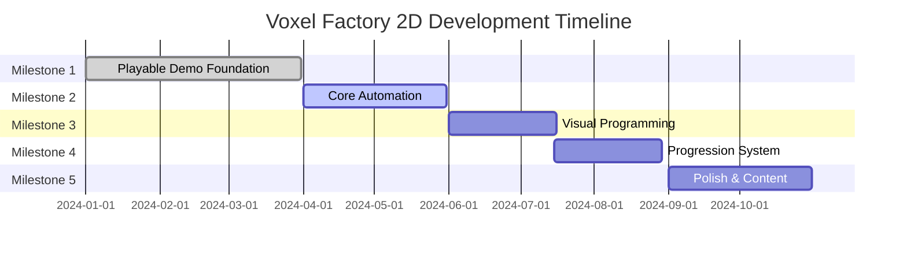
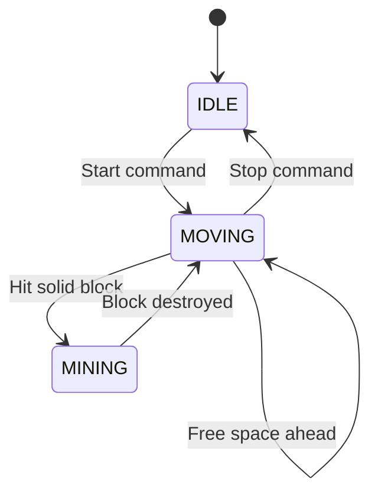

# Voxel Factory 2D - Development Roadmap

## Table of Contents
1. [Current State](#current-state)
2. [Roadmap Overview](#roadmap-overview)
3. [Milestone 1: Playable Demo (Foundation)](#milestone-1-playable-demo-foundation)
4. [Milestone 2: Core Automation](#milestone-2-core-automation)
5. [Milestone 3: Visual Programming](#milestone-3-visual-programming)
6. [Milestone 4: Progression System](#milestone-4-progression-system)
7. [Milestone 5: Polish & Content](#milestone-5-polish--content)
8. [Future Considerations](#future-considerations)

---

## Current State

### ✅ Completed Features

**Core Infrastructure** (Milestone 1 - 80% Complete)
- ✅ Entity-Component-System (ECS) architecture
- ✅ Infinite procedural world generation
- ✅ Biome system (Plains, Forest, Desert, Mountains, Ocean)
- ✅ Block types (16 types including ores)
- ✅ Dynamic chunk loading around player
- ✅ Player movement and controls
- ✅ Basic mining and block placement
- ✅ Inventory system (36 slots with stacking)
- ✅ Hotbar UI (9 slots)
- ✅ Item data system
- ✅ Signal-based UI updates
- ✅ 460+ unit and integration tests
- ✅ World renderer with TileMapLayer

**Development Tools**
- ✅ GUT (Godot Unit Testing) framework
- ✅ Automated test suite
- ✅ Project documentation structure

### 🚧 In Progress

**UI/UX Improvements**
- 🚧 Editor UI/UX enhancements
- 🚧 Miner inventory access UI
- 🚧 Full inventory screen (beyond hotbar)

### ❌ Not Yet Implemented

**Essential for Demo**
- ❌ Crafting system
- ❌ Item recipes
- ❌ Visual programming UI (node graph editor)
- ❌ Command block execution
- ❌ Miner autonomous behavior
- ❌ Conveyor belt visuals and physics
- ❌ Save/load system
- ❌ Tutorial system

**Advanced Features**
- ❌ Pocket dimensions (multi-world)
- ❌ Advanced automation
- ❌ Complex item processing
- ❌ Progression gates

---

## Roadmap Overview



### Milestone Priorities

| Milestone | Goal | Duration | Complexity |
|-----------|------|----------|------------|
| **M1: Playable Demo** | Basic mining and building | 3 months | ⭐⭐ Medium |
| **M2: Core Automation** | Working miners and conveyors | 2 months | ⭐⭐⭐ High |
| **M3: Visual Programming** | Node-based automation control | 1.5 months | ⭐⭐⭐⭐ Very High |
| **M4: Progression System** | Unlocks and objectives | 1.5 months | ⭐⭐ Medium |
| **M5: Polish & Content** | Balance, content, and UX | 2 months | ⭐⭐ Medium |

---

## Milestone 1: Playable Demo (Foundation)

**Status**: 80% Complete ✅🚧

**Goal**: Create a playable Minecraft-like experience with mining, building, and inventory management.

### Objectives

- [x] Infinite world generation with biomes
- [x] Player movement and camera
- [x] Mining blocks (left click)
- [x] Placing blocks (right click)
- [x] Inventory system with UI
- [ ] Full inventory screen (36 slots visible)
- [ ] Basic crafting system
- [ ] Item recipes (tools, blocks)
- [ ] Save/load world state

### Technical Tasks

#### 1. Full Inventory UI (Priority: High)

**Current State**: Hotbar shows 9 slots, but full 36-slot inventory is not accessible.

**Tasks**:
- [ ] Create `FullInventoryUI` scene (GridContainer with 36 slots)
- [ ] Add toggle key (Tab or I) to open/close full inventory
- [ ] Implement click-to-select and shift-click-to-move
- [ ] Add visual feedback for selected slot
- [ ] Test inventory UI with mouse and keyboard

**Estimated Effort**: 3-5 days

**Files to Create/Modify**:
- `game/scenes/ui/full_inventory_ui.tscn` (new)
- `game/scripts/ui/full_inventory_ui.gd` (new)
- `game/scripts/player/input_manager.gd` (add inventory toggle)

#### 2. Crafting System (Priority: High)

**Current State**: No crafting system exists.

**Tasks**:
- [ ] Create `Recipe` resource class (inputs, outputs, crafting time)
- [ ] Create `CraftingManager` to validate and execute recipes
- [ ] Create `CraftingUI` scene (recipe list, preview, craft button)
- [ ] Define initial recipes (tools: pickaxe, shovel, axe; blocks: planks, crafting table)
- [ ] Integrate crafting UI with inventory UI
- [ ] Add crafting tests

**Estimated Effort**: 5-7 days

**Files to Create/Modify**:
- `game/scripts/crafting/recipe.gd` (new)
- `game/scripts/crafting/crafting_manager.gd` (new)
- `game/scripts/crafting/recipe_database.gd` (new)
- `game/scenes/ui/crafting_ui.tscn` (new)
- `game/scripts/ui/crafting_ui.gd` (new)
- `tests/unit/test_crafting.gd` (new)

**Example Recipe Format**:
```gdscript
# Planks from Wood
Recipe.new({
    "inputs": [{item: ItemType.WOOD, count: 1}],
    "outputs": [{item: ItemType.PLANKS, count: 4}],
    "crafting_time": 1.0
})
```

#### 3. Save/Load System (Priority: Medium)

**Current State**: World state is lost on exit.

**Tasks**:
- [ ] Create `SaveManager` class
- [ ] Serialize TileWorld chunks to disk
- [ ] Serialize player position and inventory
- [ ] Serialize entity states (miners, conveyors)
- [ ] Implement auto-save every N minutes
- [ ] Add save/load menu options
- [ ] Test save/load with large worlds

**Estimated Effort**: 7-10 days

**Files to Create/Modify**:
- `game/scripts/save/save_manager.gd` (new)
- `game/scripts/save/world_saver.gd` (new)
- `game/scripts/save/entity_saver.gd` (new)
- `game/scripts/world/tile_world.gd` (add serialize/deserialize)
- `tests/unit/test_save_system.gd` (new)

**Save Format** (JSON):
```json
{
    "version": "0.1.0",
    "world": {
        "seed": 12345,
        "chunks": {
            "0,0": { "blocks": [...] },
            "1,0": { "blocks": [...] }
        }
    },
    "player": {
        "position": {"x": 100, "y": 50},
        "inventory": [...]
    },
    "entities": [
        {"type": "Miner", "position": {...}, "components": {...}}
    ]
}
```

### Deliverables

✅ **Demo Video**: Player mines wood → crafts planks → builds structure → saves game → loads game

**Acceptance Criteria**:
- Player can open full inventory with Tab key
- Player can craft items from recipes
- Player can save game and reload with same world state

---

## Milestone 2: Core Automation

**Status**: Not Started ❌

**Goal**: Implement working miners and conveyors for basic automation.

### Objectives

- [ ] Miner entity autonomous mining behavior
- [ ] Conveyor belt item transport
- [ ] Item entity visuals and physics
- [ ] Miner-to-conveyor item output
- [ ] Conveyor-to-chest storage
- [ ] Basic resource pipelines

### Technical Tasks

#### 1. Miner Autonomous Behavior (Priority: High)

**Current State**: Miner entity exists but doesn't move or mine automatically.

**Tasks**:
- [ ] Implement state machine (IDLE, MOVING, MINING)
- [ ] Add pathfinding (simple: move forward, turn at walls)
- [ ] Implement mining animation and block destruction
- [ ] Add mined items to miner inventory
- [ ] Create `MinerData` resource (speed, mining power, inventory size)
- [ ] Add visual feedback (progress bar, tool animation)
- [ ] Test miner behavior in various scenarios

**Estimated Effort**: 5-7 days

**Files to Modify**:
- `game/scripts/entities/miner.gd` (implement logic in _process)
- `game/scenes/entities/miner.tscn` (add sprites, animations)
- `game/resources/entities/miner_data.tres` (new resource)
- `tests/unit/test_miner.gd` (update tests)

**State Machine**:


#### 2. Conveyor Belt System (Priority: High)

**Current State**: Conveyor entity and BeltNode component exist but no visual or logic.

**Tasks**:
- [ ] Implement `BeltSystem.process_entity()` logic
- [ ] Create item movement between belt nodes
- [ ] Add belt direction (left, right, up, down)
- [ ] Create belt sprites (4 directions)
- [ ] Add item entity visuals (floating items on belts)
- [ ] Implement belt-to-belt connections
- [ ] Handle items reaching belt endpoints
- [ ] Test belt networks of various shapes

**Estimated Effort**: 7-10 days

**Files to Modify**:
- `game/scripts/components/belt_node.gd` (add item queue logic)
- `game/scripts/systems/belt_system.gd` (implement processing)
- `game/scenes/entities/conveyor.tscn` (add sprites)
- `game/resources/tiles/belt_tileset.tres` (new)
- `tests/unit/test_belt_system.gd` (new)

**Belt Logic**:
```gdscript
# Each belt node has:
# - position: Vector2i
# - direction: Vector2i (RIGHT, LEFT, UP, DOWN)
# - items: Array of {type: ItemType, progress: float}
# - next_node: BeltNode or null

# Each frame:
# 1. Move items along progress (0.0 to 1.0)
# 2. Transfer items at progress >= 1.0 to next node
# 3. Accept new items from previous node if space available
```

#### 3. Item Entities (Priority: Medium)

**Current State**: Items only exist as inventory data, no visual representation.

**Tasks**:
- [ ] Create `ItemEntity` scene (Area2D with sprite)
- [ ] Add item pickup by player (on collision)
- [ ] Add item output from miners
- [ ] Add item visuals on conveyor belts
- [ ] Implement item stacking on ground (merge nearby items)
- [ ] Add despawn timer for dropped items
- [ ] Test item lifecycle (spawn, move, pickup, despawn)

**Estimated Effort**: 3-5 days

**Files to Create/Modify**:
- `game/scenes/entities/item_entity.tscn` (new)
- `game/scripts/entities/item_entity.gd` (new)
- `game/scripts/player/player_controller.gd` (add pickup)
- `tests/unit/test_item_entity.gd` (new)

#### 4. Miner-Conveyor Integration (Priority: Medium)

**Current State**: No connection between miners and conveyors.

**Tasks**:
- [ ] Add output direction to miners
- [ ] Detect conveyor belt in front of miner
- [ ] Transfer items from miner inventory to belt
- [ ] Add visual indicator (arrow) for output
- [ ] Test miner outputting to belt networks

**Estimated Effort**: 2-3 days

**Files to Modify**:
- `game/scripts/entities/miner.gd` (add output logic)
- `game/scripts/systems/belt_system.gd` (add input from miners)

### Deliverables

✅ **Demo Video**: Place miner → miner autonomously mines → outputs to conveyor → conveyor transports to chest

**Acceptance Criteria**:
- Miner moves forward and mines blocks automatically
- Conveyor belts transport items between nodes
- Items visually appear on belts and can be picked up
- Complete automation loop works (miner → belt → storage)

---

## Milestone 3: Visual Programming

**Status**: Not Started ❌

**Goal**: Implement node-based visual programming for miner control.

### Objectives

- [ ] Graph editor UI for creating programs
- [ ] Command block nodes (Move, Mine, Condition, Loop)
- [ ] Program execution engine
- [ ] Save/load programs
- [ ] Program validation and debugging
- [ ] In-game programming tutorial

### Technical Tasks

#### 1. Graph Editor UI (Priority: High)

**Current State**: Visual programming system exists in code but has no UI.

**Tasks**:
- [ ] Create `GraphEditorUI` scene (GraphEdit node)
- [ ] Create command block node templates (Move, Mine, Wait, etc.)
- [ ] Implement drag-and-drop node creation
- [ ] Implement node connection (flow lines)
- [ ] Add node property editors (parameters)
- [ ] Implement save/load graph to Program component
- [ ] Add zoom and pan controls
- [ ] Test UI with complex programs

**Estimated Effort**: 10-14 days

**Files to Create/Modify**:
- `game/scenes/ui/graph_editor_ui.tscn` (new)
- `game/scripts/ui/graph_editor_ui.gd` (new)
- `game/scripts/ui/command_block_node_ui.gd` (new)
- `game/scripts/programming/command_block.gd` (update for UI)
- `game/scripts/components/program.gd` (add serialize/deserialize)

**Block Types to Implement**:
```gdscript
enum BlockType {
    MOVE,           # Move forward N tiles
    TURN,           # Turn left/right
    MINE,           # Mine block in direction
    PLACE,          # Place block from inventory
    WAIT,           # Wait N seconds
    CONDITION,      # If/else branching
    LOOP,           # Repeat N times or forever
    INVENTORY_CHECK,# Check if item in inventory
    GOTO,           # Jump to another block
}
```

#### 2. Program Execution (Priority: High)

**Current State**: `GraphExecutor` exists but is not fully integrated.

**Tasks**:
- [ ] Implement execution context (entity, world, inventory)
- [ ] Implement each command block type (Move, Mine, etc.)
- [ ] Add execution state (IDLE, RUNNING, PAUSED, COMPLETED)
- [ ] Add single-step execution for debugging
- [ ] Add execution speed control (slow, normal, fast)
- [ ] Implement error handling (invalid commands, stuck states)
- [ ] Add visual feedback (highlight current block)
- [ ] Test programs with all block types

**Estimated Effort**: 7-10 days

**Files to Modify**:
- `game/scripts/programming/graph_executor.gd` (implement execution)
- `game/scripts/programming/blocks/*.gd` (implement each block type)
- `game/scripts/entities/miner.gd` (integrate executor)
- `tests/unit/test_graph_executor.gd` (expand tests)

#### 3. Programming Tutorial (Priority: Medium)

**Current State**: No tutorial exists.

**Tasks**:
- [ ] Create `TutorialManager` system
- [ ] Design tutorial levels (5-7 stages)
- [ ] Implement tutorial UI (objectives, hints, next button)
- [ ] Create tutorial world presets (controlled scenarios)
- [ ] Add tutorial completion tracking
- [ ] Test tutorial with new players

**Estimated Effort**: 5-7 days

**Tutorial Stages**:
1. **Hello World**: Move miner 3 tiles forward
2. **Basic Mining**: Mine 5 stone blocks
3. **Loops**: Use loop to mine 10 blocks efficiently
4. **Conditions**: Mine until inventory full, then stop
5. **Output**: Mine and output items to conveyor
6. **Multiple Miners**: Coordinate 2 miners with different programs
7. **Challenge**: Build a complete mining operation

### Deliverables

✅ **Demo Video**: Open graph editor → create mining program → assign to miner → watch miner execute program

**Acceptance Criteria**:
- Player can create and edit programs in graph editor
- All command block types work correctly
- Miners execute programs autonomously
- Tutorial teaches programming concepts progressively

---

## Milestone 4: Progression System

**Status**: Not Started ❌

**Goal**: Add unlocks, objectives, and progression mechanics.

### Objectives

- [ ] Technology tree (unlockable features)
- [ ] Research system (spend resources to unlock)
- [ ] Objective system (quests/goals)
- [ ] Achievement tracking
- [ ] Progression UI (tech tree, objectives panel)

### Technical Tasks

#### 1. Technology Tree (Priority: High)

**Tasks**:
- [ ] Create `Technology` resource (name, description, cost, unlocks)
- [ ] Create `TechTree` database (dependencies between techs)
- [ ] Implement unlock logic (check requirements, deduct cost)
- [ ] Create tech tree UI (node graph showing available/locked techs)
- [ ] Add progression save/load
- [ ] Test tech tree with various paths

**Estimated Effort**: 7-10 days

**Example Technologies**:
```
Tier 1: Basic Mining
  ├── Better Tools (faster mining)
  └── Inventory Expansion (+18 slots)

Tier 2: Automation
  ├── Miners (unlock miner entity)
  ├── Conveyors (unlock conveyor belts)
  └── Programming (unlock visual programming)

Tier 3: Advanced
  ├── Advanced Miners (faster, larger inventory)
  ├── Smart Conveyors (filters, sorters)
  └── Pocket Dimensions (parallel worlds)
```

#### 2. Objective System (Priority: Medium)

**Tasks**:
- [ ] Create `Objective` resource (description, completion condition)
- [ ] Create `ObjectiveManager` to track active objectives
- [ ] Implement objective types (collect items, craft items, build structures)
- [ ] Create objectives UI (panel showing current goals)
- [ ] Add objective completion rewards
- [ ] Test objectives with various conditions

**Estimated Effort**: 5-7 days

#### 3. Achievement System (Priority: Low)

**Tasks**:
- [ ] Create `Achievement` resource (title, description, icon, unlock condition)
- [ ] Track achievement progress
- [ ] Show achievement unlock notifications
- [ ] Create achievements UI (grid showing locked/unlocked)
- [ ] Define initial achievements (20-30)

**Estimated Effort**: 3-5 days

### Deliverables

✅ **Demo Video**: Complete objectives → earn resources → unlock technologies → gain new capabilities

**Acceptance Criteria**:
- Player progresses through tech tree by completing objectives
- New features unlock as player advances
- Achievements reward creative play

---

## Milestone 5: Polish & Content

**Status**: Not Started ❌

**Goal**: Improve UX, balance game, and add content variety.

### Objectives

- [ ] Sound effects and music
- [ ] Particle effects (mining, explosions)
- [ ] UI polish (animations, transitions)
- [ ] Performance optimization
- [ ] More biomes and block types
- [ ] More automation options
- [ ] Balance testing and tuning

### Technical Tasks

#### 1. Audio System (Priority: High)

**Tasks**:
- [ ] Add sound effects (mining, placing, footsteps, UI clicks)
- [ ] Add background music (adaptive based on location/situation)
- [ ] Implement audio manager (volume control, muting)
- [ ] Create audio settings menu
- [ ] Test audio with all game actions

**Estimated Effort**: 5-7 days

#### 2. Visual Polish (Priority: Medium)

**Tasks**:
- [ ] Add particle effects (mining dust, water splash, item pickup)
- [ ] Add animations (chest opening, miner working)
- [ ] Improve UI transitions (fade in/out, slide)
- [ ] Add visual feedback (damage numbers, completion checkmarks)
- [ ] Create animated sprites for entities

**Estimated Effort**: 7-10 days

#### 3. Performance Optimization (Priority: High)

**Tasks**:
- [ ] Profile critical paths (world gen, rendering, ECS systems)
- [ ] Optimize chunk generation (parallelize)
- [ ] Optimize entity processing (spatial partitioning)
- [ ] Optimize UI updates (delta compression)
- [ ] Add performance metrics display (FPS, entity count, chunk count)
- [ ] Test with large factories (1000+ entities)

**Estimated Effort**: 5-7 days

#### 4. Content Expansion (Priority: Medium)

**Tasks**:
- [ ] Add 3-5 new biomes (Swamp, Jungle, Tundra, etc.)
- [ ] Add 10-15 new block types
- [ ] Add 5-10 new item types
- [ ] Add new automation blocks (splitters, mergers, filters)
- [ ] Add new recipes (50+ total)
- [ ] Balance resource distribution

**Estimated Effort**: 10-14 days

### Deliverables

✅ **Demo Video**: Polished gameplay with audio, effects, and smooth performance

**Acceptance Criteria**:
- Game runs at 60 FPS with 500+ entities
- Audio and visual effects enhance gameplay feel
- Diverse biomes and blocks create varied experiences

---

## Future Considerations

### Post-Launch Features

**Multiplayer** (High Complexity, 3-6 months)
- [ ] Dedicated server architecture
- [ ] Client-server synchronization
- [ ] Shared factories with permission system
- [ ] Chat and collaboration tools

**Modding Support** (Medium Complexity, 2-3 months)
- [ ] Mod loader system
- [ ] Scriptable blocks and items
- [ ] Custom biome definitions
- [ ] API documentation for modders

**Advanced Automation** (Medium Complexity, 2-3 months)
- [ ] Circuit networks (logic gates)
- [ ] Wireless signals
- [ ] Train systems
- [ ] Fluid handling (pipes, tanks)

**Story Mode** (Low Complexity, 1-2 months)
- [ ] Campaign missions
- [ ] Narrative progression
- [ ] Boss encounters
- [ ] Story-driven unlocks

### Platform Expansion

- [ ] Mobile port (Android/iOS)
- [ ] Console port (Switch/PlayStation/Xbox)
- [ ] Web version (HTML5 export)

---

## Tracking Progress

### Development Velocity

Based on current team capacity:
- **Solo Developer**: ~15-20 hours/week → 1 milestone per 3 months
- **Small Team (2-3)**: ~40-60 hours/week → 1 milestone per 1.5 months
- **Full Team (5+)**: ~100+ hours/week → 1 milestone per month

### Risk Assessment

| Risk | Probability | Impact | Mitigation |
|------|-------------|--------|------------|
| Visual programming too complex | Medium | High | Start simple, iterate based on feedback |
| Performance issues with many entities | Medium | High | Profile early, optimize incrementally |
| Scope creep | High | Medium | Stick to roadmap, defer non-essential features |
| Player confusion with automation | Medium | High | Invest in tutorial system |

### Success Metrics

**Milestone 1 (Playable Demo)**:
- [ ] 5 playtests with new users
- [ ] Average play session: 15-30 minutes
- [ ] 80% tutorial completion rate

**Milestone 2 (Core Automation)**:
- [ ] 10 playtests with automation focus
- [ ] Players build 3+ miner setups
- [ ] No game-breaking bugs in automation

**Milestone 3 (Visual Programming)**:
- [ ] 15 playtests with programming focus
- [ ] 70% complete all tutorial levels
- [ ] Players create 5+ unique programs

---

## How to Use This Roadmap

1. **Review Regularly**: Check progress weekly, update task status
2. **Adjust as Needed**: Roadmap is flexible, priorities may shift
3. **Celebrate Milestones**: Recognize achievements, share demos
4. **Gather Feedback**: Playtest after each milestone, iterate

---

## Related Documentation

- [Architecture](./architecture.md) - Technical implementation details
- [ECS Design](./ecs-design.md) - Entity-Component-System patterns
- [Conductor Tracks](../conductor/tracks.md) - Active development tracks

---

*This roadmap is a living document. Last updated: 2024-01-15*
