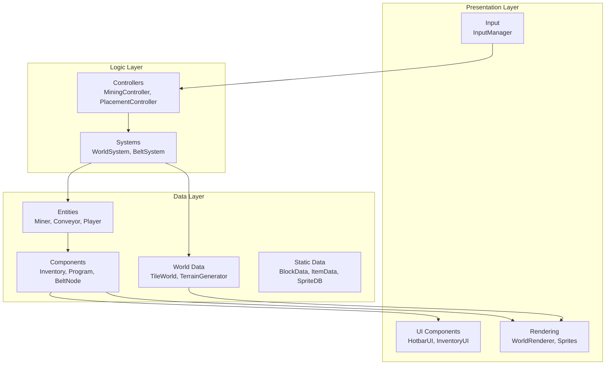
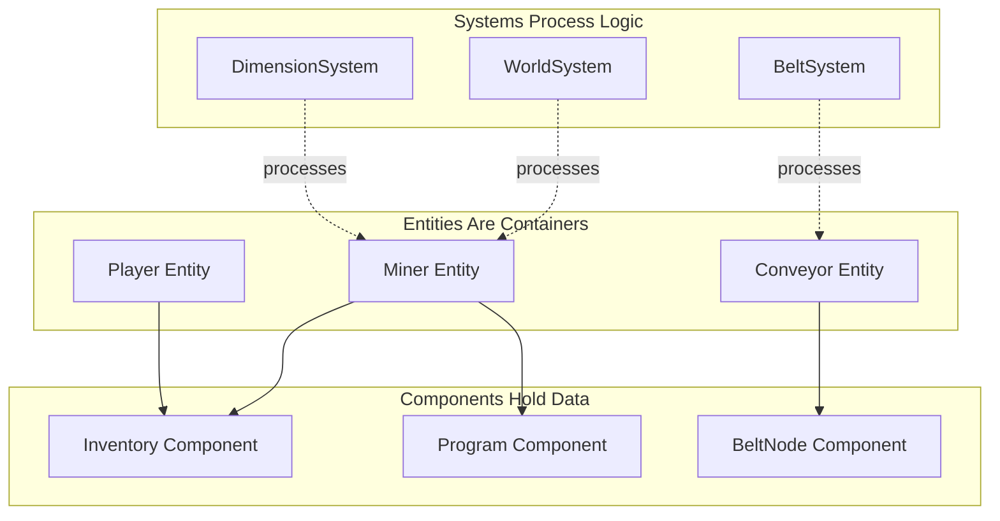
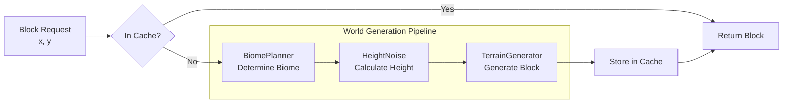
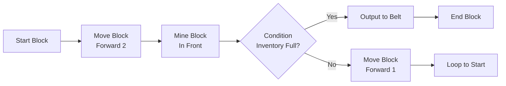
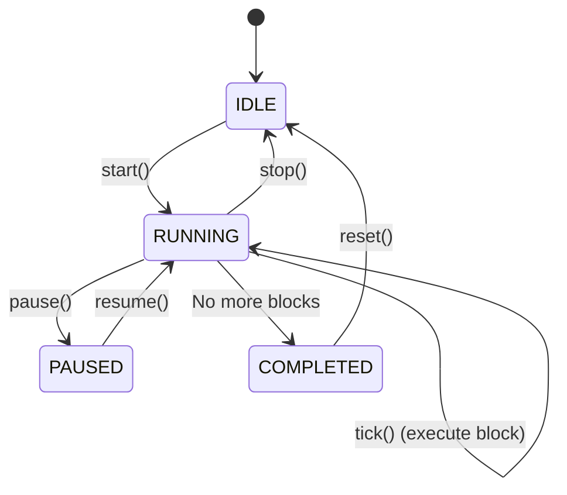
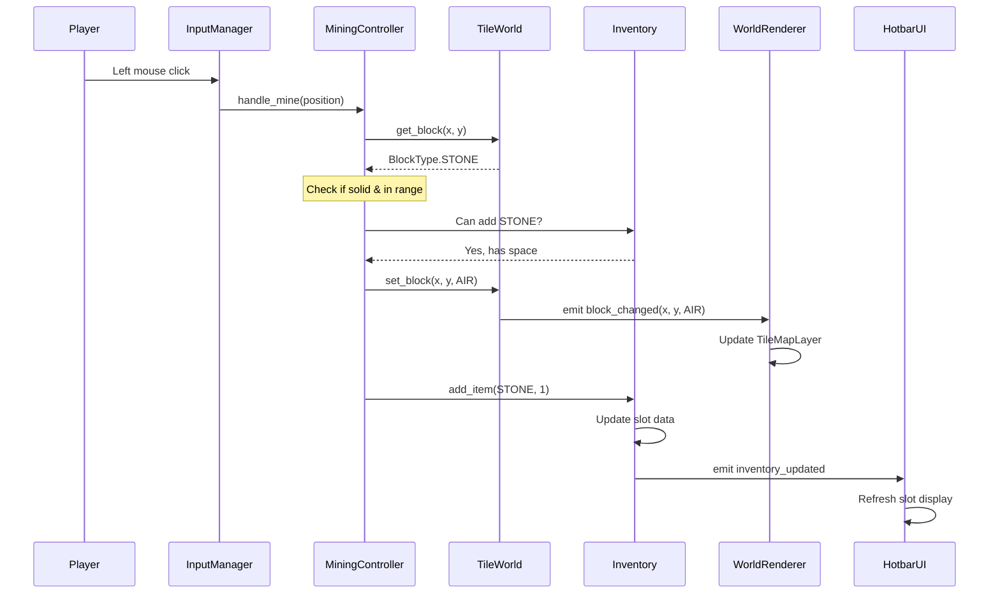
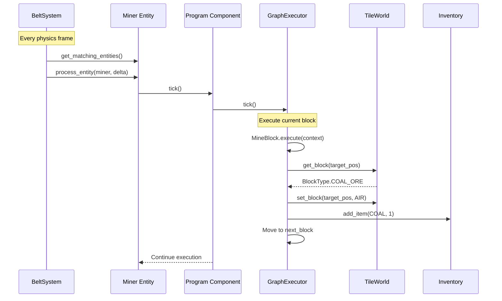
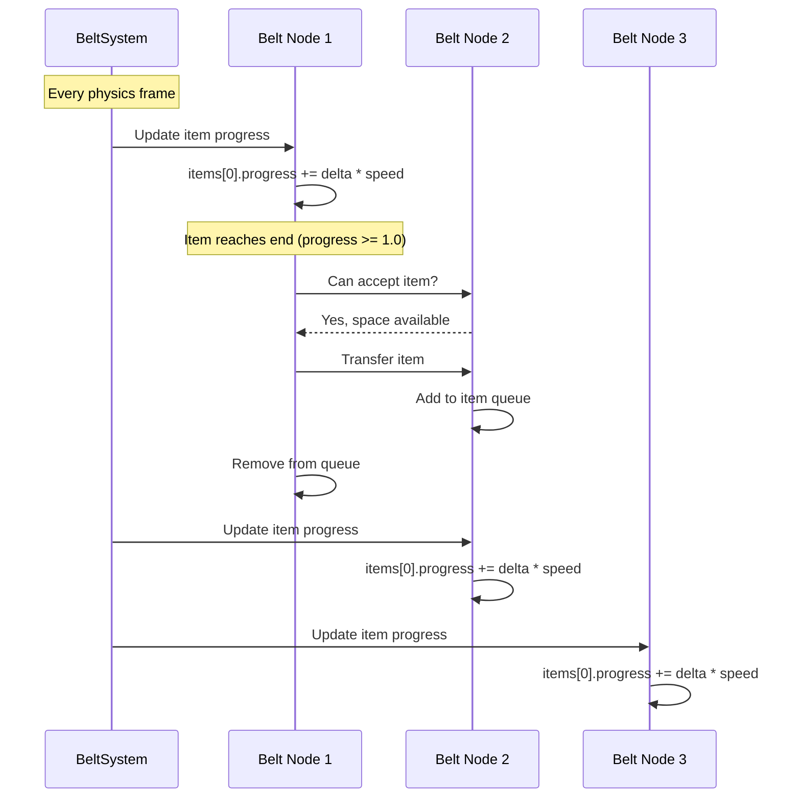
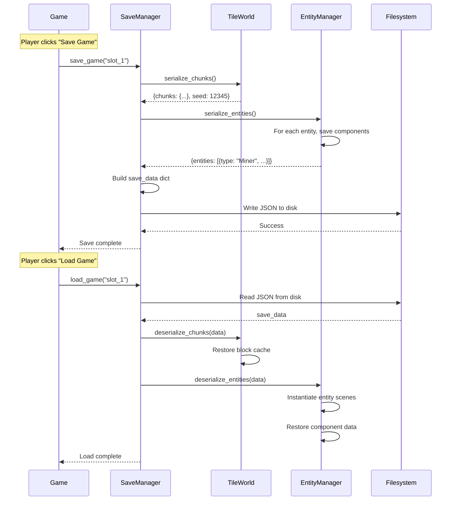

# Voxel Factory 2D - Architecture

## Overview

Voxel Factory 2D is a 2D side-scrolling sandbox automation game built with Godot 4.6. The architecture combines an Entity-Component-System (ECS) pattern for game logic with Godot's native scene system for rendering and UI.

### Key Design Goals

1. **Modularity**: Systems and components can be developed and tested independently
2. **Scalability**: Handle thousands of entities and infinite world generation efficiently
3. **Maintainability**: Clear separation of concerns between data, logic, and presentation
4. **Testability**: 460+ tests covering core functionality

### Architecture Layers



## Core Architecture Pattern: ECS

The game uses a lightweight ECS implementation to separate data from behavior. For detailed information about the ECS design patterns, implementation examples, and best practices, see the [ECS Design Documentation](./ecs-design.md).

### ECS Quick Overview



**Key Principle**: Systems contain behavior, Components contain data, Entities are just containers.

### Why ECS?

Traditional inheritance hierarchies become unwieldy:
```
Character → Player
Character → NPC → Enemy
Character → NPC → Merchant
```

With ECS, we compose instead:
```
Player = Entity + Inventory + CharacterBody2D
Miner = Entity + Inventory + Program
Merchant = Entity + Inventory + DialogueTree
```

### Components (`game/scripts/core/`)

Components are pure data containers that extend `Resource`:

- **Component** (`component.gd`) - Base class with `entity` back-reference
- **Inventory** (`inventory.gd`) - Stores items with slots, counts, max stack
- **Program** (`program.gd`) - Contains a visual programming graph
- **BeltNode** (`belt_node.gd`) - Conveyor belt position, direction, items

> 📖 **Deep Dive**: For detailed component implementation patterns, lifecycle management, and code examples, see [ECS Design - Components](./ecs-design.md#2-components-data-layer).

### Entities (`game/scripts/entities/`)

Entities are containers for components, extending `Node2D`:

- **Entity** (`entity.gd`) - Base class with component dictionary
- **Miner** (`miner.gd`) - Mining automation entity (has Inventory + Program)
- **Conveyor** (`conveyor.gd`) - Item transport entity (has BeltNode)

> 📖 **Deep Dive**: For entity creation patterns, component management, and practical examples, see [ECS Design - Entities](./ecs-design.md#2-entities-container-layer).

### Systems (`game/scripts/world/`)

Systems contain game logic and process entities:

- **System** (`system.gd`) - Base class with `required_components` and `process_entity()`
- **WorldSystem** (`world_system.gd`) - Manages TileWorld, block get/set
- **DimensionSystem** (`dimension_system.gd`) - Multiple parallel worlds (overworld, pocket dimensions)
- **BeltSystem** (`belt_system.gd`) - Processes conveyor belt item movement

> 📖 **Deep Dive**: For system patterns, entity queries, execution order, and best practices, see [ECS Design - Systems](./ecs-design.md#3-systems-logic-layer).

## World Generation

### TileWorld (`game/scripts/world/tile_world.gd`)

The infinite procedural world is generated lazily using a pipeline architecture:



**Key Components:**
- **TileWorld** - Main interface for block operations, handles caching
- **TerrainGenerator** - Produces blocks based on (x, y) position  
- **BiomePlanner** - Determines biome at each location using noise
- **HeightNoise** - Varies terrain height using Simplex noise
- **Block Changed Signal** - Emitted when blocks are modified

**Generation Flow:**
1. Request block at (x, y)
2. Check cache (Dictionary with Vector2i keys)
3. If not cached:
   - Query BiomePlanner for biome type
   - Calculate terrain height with HeightNoise
   - Generate appropriate block with TerrainGenerator
   - Cache result for future access
4. Return block type

**Coordinate System:**
- World Y-axis: Positive Y = higher altitude (up)
- Screen Y-axis: Positive Y = down (Godot standard)
- Conversion: `screen_y = -world_y`

### Block Types (`game/scripts/world/block_data.gd`)

```gdscript
enum BlockType {
    AIR = 0,      # Empty space (no collision)
    GRASS = 1,    # Surface block
    DIRT = 2,     # Subsurface
    STONE = 3,    # Underground
    WOOD = 4,     # Trees
    LEAVES = 5,   # Tree canopy
    SAND = 6,     # Desert/beach
    WATER = 7,    # Liquid (no collision)
    COAL_ORE = 8,
    IRON_ORE = 9,
    GOLD_ORE = 10,
    DIAMOND_ORE = 11,
    COBBLESTONE = 12,  # Placed/dropped stone
    PLANKS = 13,       # Crafted wood
    BEDROCK = 14       # Indestructible
}
```

### Biomes (`game/scripts/world/biome_data.gd`)

Each biome has:
- Surface block type (GRASS, SAND, etc.)
- Subsurface block type
- Height range (min/max terrain height)

```
PLAINS   - Grass/Dirt, height 20-40
FOREST   - Grass/Dirt, height 25-45
DESERT   - Sand/Sand, height 15-35
MOUNTAINS - Stone/Stone, height 50-80
OCEAN    - Sand/Stone, height 5-15
```

## Visual Programming System

### Command Blocks (`game/scripts/programming/`)

Players create automation through visual programming using a graph-based system:



**Command Block Structure:**
```gdscript
CommandBlock (base)
    ├── block_type: enum (MOVE, MINE, CONDITION, etc.)
    ├── parameters: Dictionary (block-specific settings)
    ├── next_block: CommandBlock (linear flow)
    └── outputs: Dictionary (branching for conditions)
```

**Available Block Types:**
- **MoveBlock** - Move entity forward/backward N tiles
- **TurnBlock** - Rotate entity left/right
- **MineBlock** - Mine block in specified direction
- **PlaceBlock** - Place block from inventory
- **WaitBlock** - Pause execution for N seconds
- **ConditionBlock** - Branch based on inventory/world state
- **LoopBlock** - Repeat sequence N times or forever

### Graph Executor (`graph_executor.gd`)

Executes the visual program in a controlled manner:



**Execution Model:**
- **IDLE** - Program not running, waiting for start command
- **RUNNING** - Executing blocks, one per tick() call
- **PAUSED** - Execution suspended, state preserved
- **COMPLETED** - All blocks executed, awaiting reset

**Context Passed to Blocks:**
```gdscript
{
    "entity": MinerEntity,      # The entity running the program
    "world": TileWorld,          # For block operations
    "inventory": Inventory,      # For item management
    "position": Vector2i,        # Current entity position
    "direction": Vector2i        # Current facing direction
}
```

## Rendering Layer

### Scene-First with ECS Bridge

The rendering uses Godot scenes that bridge to ECS data:

```
Main.tscn
    ├── WorldRenderer (TileMapLayer synced to TileWorld via signals)
    ├── Player (CharacterBody2D with PlayerController script)
    ├── InputManager (Processes input, delegates to controllers)
    ├── MiningController (Handles mine actions)
    ├── PlacementController (Handles place actions)
    └── CanvasLayer
            ├── HotbarUI (9 slots)
            └── InventoryUI (36 slots)
```

### WorldRenderer (`game/scripts/rendering/world_renderer.gd`)

Syncs TileWorld to visual TileMapLayer:

1. Connects to `TileWorld.block_changed` signal
2. On change: updates TileMapLayer cell
3. Maps `BlockType` enum values to TileSet atlas X coordinates
4. Handles Y-axis inversion (world Y → screen -Y)

## File Structure

```
program-builder/
├── game/
│   ├── scenes/
│   │   ├── main.tscn          # Main game scene
│   │   └── player.tscn        # Player prefab
│   │
│   ├── scripts/
│   │   ├── core/              # ECS base classes
│   │   │   ├── component.gd
│   │   │   ├── entity.gd
│   │   │   └── system.gd
│   │   │
    │   │   ├── data/              # Static data classes
    │   │   │   ├── block_data.gd
    │   │   │   ├── item_data.gd
    │   │   │   └── sprite_db.gd
    │   │   │
    │   │   ├── world/             # World generation
    │   │   │   ├── tile_world.gd
    │   │   │   ├── terrain_generator.gd
    │   │   │   ├── biome_planner.gd
    │   │   │   ├── biome_data.gd
    │   │   │   ├── world_system.gd
    │   │   │   └── dimension_system.gd
│   │   │
│   │   ├── entities/          # Game entities
│   │   │   ├── miner.gd
│   │   │   └── conveyor.gd
│   │   │
│   │   ├── components/        # Component data
│   │   │   ├── inventory.gd
│   │   │   ├── belt_node.gd
│   │   │   └── belt_system.gd
│   │   │
│   │   ├── programming/       # Visual programming
│   │   │   ├── command_block.gd
│   │   │   ├── mine_block.gd
│   │   │   ├── program.gd
│   │   │   └── graph_executor.gd
│   │   │
│   │   ├── player/            # Player controllers
│   │   │   ├── player_controller.gd
│   │   │   ├── mining_controller.gd
│   │   │   ├── placement_controller.gd
│   │   │   └── input_manager.gd
│   │   │
│   │   ├── ui/                # UI components
│   │   │   ├── hotbar_ui.gd
│   │   │   └── inventory_ui.gd
│   │   │
│   │   └── rendering/         # Visual rendering
│   │       └── world_renderer.gd
│   │
    │   └── resources/
    │       ├── tiles/
    │       │   ├── terrain_tileset.tres
    │       │   └── terrain_atlas.png
    │       ├── sprites/
    │       │   └── entities/        # Miner, conveyor, item sprites
    │       └── icons/
    │           └── items/
    │               └── item_icon_atlas.png
│
├── tests/
│   ├── unit/                  # Unit tests (GUT framework)
│   └── integration/           # Integration tests
│
└── docs/                      # Documentation
```

## Data Flow & Interaction Patterns

Understanding how data flows through the system is crucial for debugging and extending functionality.

### 1. Player Mining Operation



**Key Points:**
- InputManager decouples input from logic
- MiningController validates before modifying world
- TileWorld notifies renderers via signals (decoupled)
- Inventory signals ensure UI stays synchronized

### 2. Miner Entity Autonomous Behavior



**Key Points:**
- Systems process entities in physics frames (60 FPS)
- Program execution is incremental (one block per tick)
- Context dict provides access to entity, world, inventory
- Miners operate independently, no player input needed

### 3. Conveyor Belt Item Transport



**Key Points:**
- BeltSystem processes all belt nodes each frame
- Items have progress value (0.0 to 1.0) along belt
- Transfer only happens when next node has space
- Supports complex networks (junctions, merges)

### 4. Save/Load World State



**Key Points:**
- Only modified chunks are saved (lazy worlds don't save everything)
- Entity serialization includes all component data
- Components must implement serialize/deserialize methods
- Save format is JSON for human-readability and debugging

## Key Design Decisions

### 1. Lazy World Generation

Blocks are generated on-demand when first accessed, not pre-generated. This allows infinite worlds without memory constraints.

### 2. Signal-Based UI Updates

UI components connect to `inventory_updated` signal rather than polling. This keeps UI in sync without tight coupling.

### 3. Y-Axis Inversion

World coordinates use "Y up" (higher Y = higher altitude) for intuitive terrain math, while Godot uses "Y down". The WorldRenderer and controllers handle the conversion.

### 4. Controller Separation

Input handling is separated from game logic:
- `InputManager` - Reads input, calls controller methods
- `MiningController` - Handles mining logic, range checks, inventory
- `PlacementController` - Handles placement logic, item consumption

### 5. Direct Tile Mapping (No Terrain Sets)

The rendering pipeline uses a **direct 1:1 mapping** from `BlockType` enum value to atlas X coordinate:

```gdscript
tile_map_layer.set_cell(screen_pos, TILE_SOURCE_ID, Vector2i(block_type, 0))
```

Godot 4 offers a **Terrain Sets** system for auto-tiling — assigning peering bits to tiles so Godot automatically selects edge/corner transition variants based on neighboring tiles. We evaluated this and chose **not** to use it for the following reasons:

| Factor | Direct mapping (current) | Terrain sets |
|--------|:---:|:---:|
| Complexity | Trivial — O(1) lookup | High — neighbor scanning per cell |
| Art workload | 1 tile per block type | 16–47 tiles per type (edge variants) |
| Proc-gen compat | No issues | Chunk-boundary bugs, batch perf concerns |
| Game genre fit | Discrete functional blocks | Designed for landscape transitions |
| Flexibility | Easy to extend | Locked into Godot's auto-tile system |

**Why it doesn't fit this game**: Blocks in Voxel Factory 2D are discrete functional units (ore, stone, conveyors), not aesthetic landscape. A dirt tile IS a dirt tile — it doesn't need 47 edge-transition variants. Terrain sets solve a visual blending problem we don't have.

**Performance**: `set_cells_terrain_connect()` scans neighbors for every cell, which community reports flag as slow for procedural generation. Our `set_cell()` approach has zero neighbor dependency and works cleanly with lazy chunk loading.

**Future path**: If visual polish is desired (e.g., stone-to-air cliff edges), a lightweight post-processing pass in `WorldRenderer` can check neighbors and pick from a small set of edge variants — without adopting the full terrain sets system. See [Issue #23](https://github.com/Snoot-Booper-Labs/Voxel-factory-2D/issues/23) for this potential enhancement.

### 6. Test-Driven Development

811+ tests cover:
- ECS infrastructure
- World generation determinism
- Inventory operations
- Controller behavior
- Signal emissions
- Integration flows

---

## Related Documentation

- **[ECS Design Guide](./ecs-design.md)** - Deep dive into Entity-Component-System patterns, best practices, and implementation examples
- **[Development Roadmap](./ROADMAP.md)** - Project milestones, feature timeline, and development tasks
- **[API Reference](./api_reference.md)** - Detailed class and method documentation
- **[Content Creation](./content_creation.md)** - Guide for adding new blocks, items, and entities
- **[Gameplay Guide](./gameplay.md)** - How to play and use game features

---

*This document provides an overview of the technical architecture. For comprehensive details on specific topics, see the related documentation above.*
