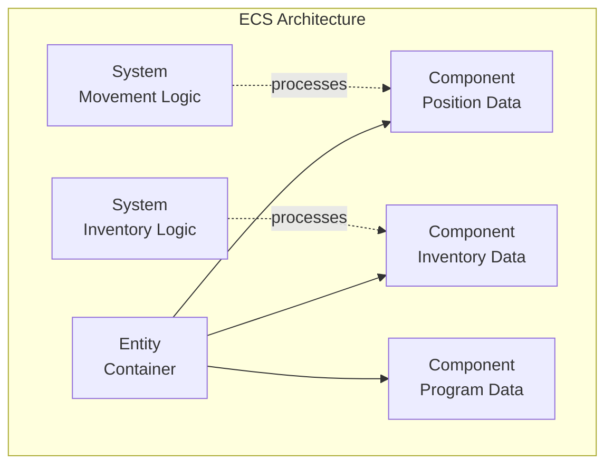
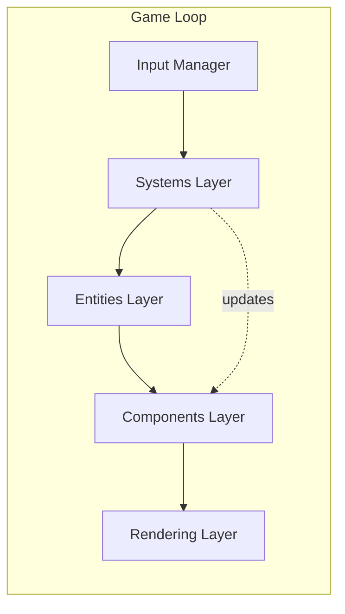
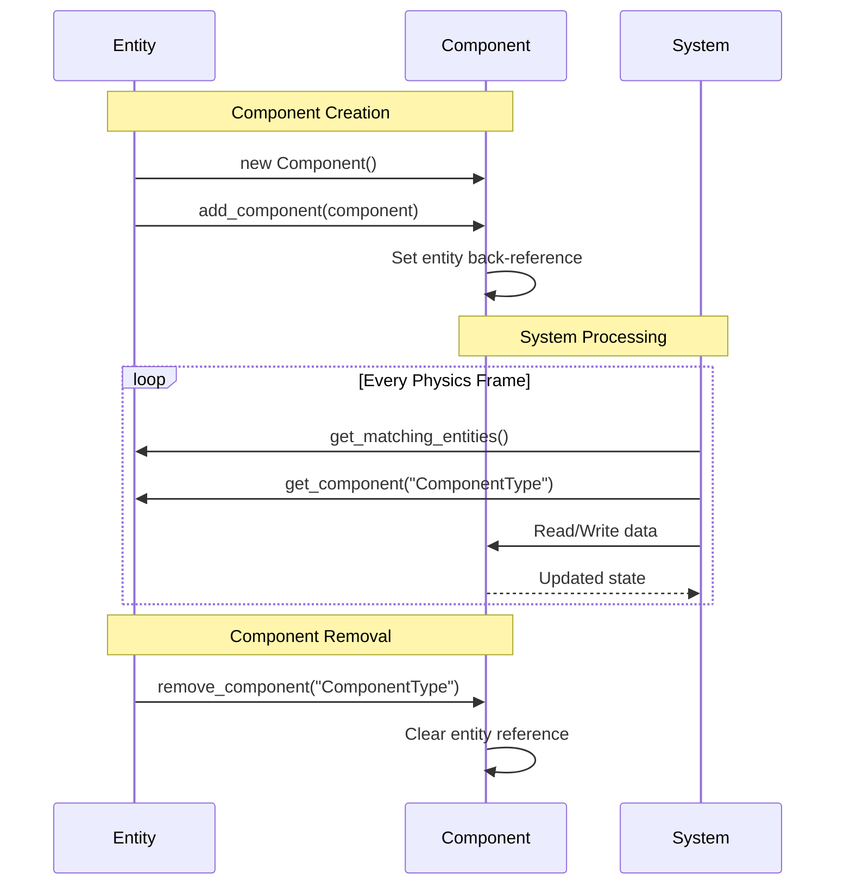
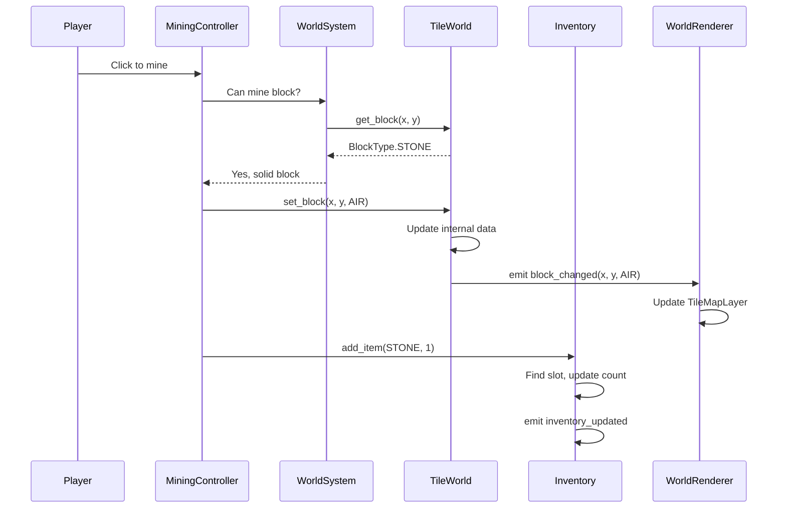
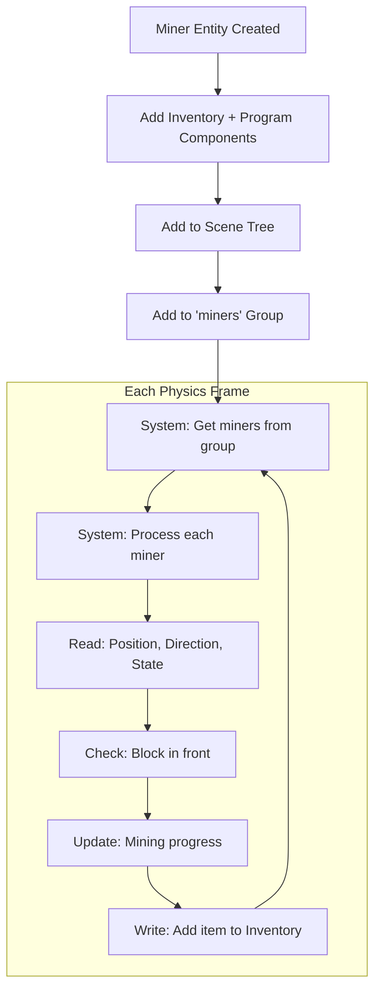

# Entity-Component-System (ECS) Design

## Table of Contents
1. [Introduction](#introduction)
2. [Core Concepts](#core-concepts)
3. [Architecture Overview](#architecture-overview)
4. [Implementation Details](#implementation-details)
5. [Data Flow](#data-flow)
6. [Practical Examples](#practical-examples)
7. [Best Practices](#best-practices)
8. [Performance Considerations](#performance-considerations)

## Introduction

Voxel Factory 2D uses a lightweight Entity-Component-System (ECS) architecture to separate game logic from data. This design pattern provides several advantages:

- **Modularity**: Components can be mixed and matched to create diverse entity behaviors
- **Maintainability**: Logic is centralized in systems, making it easier to update and debug
- **Testability**: Pure data components and isolated systems are easier to unit test
- **Performance**: Data-oriented design enables efficient processing of similar entities

Unlike heavyweight ECS frameworks, our implementation is tailored for Godot and integrates seamlessly with the engine's node system.

## Core Concepts

### What is ECS?

ECS is a design pattern that separates:
- **Entities**: Containers for components (what exists)
- **Components**: Pure data (what properties things have)
- **Systems**: Logic processors (what behaviors things exhibit)



### Why ECS for Voxel Factory 2D?

Traditional object-oriented hierarchies (e.g., `Character -> Player`, `Character -> Enemy`) lead to:
- Deep inheritance chains
- Rigid behaviors
- Code duplication

ECS solves this by composition:
- A **Miner** entity = Entity + Inventory Component + Program Component
- A **Conveyor** entity = Entity + BeltNode Component
- A **Player** entity = Entity + Inventory Component + (Godot's CharacterBody2D)

## Architecture Overview

### High-Level Structure



### Three Layers

#### 1. Components (Data Layer)

Components are pure data containers extending `Resource`. They:
- Store state (no logic)
- Have a back-reference to their owner entity
- Are identified by a unique type name

**Base Class**: `game/scripts/core/component.gd`

```gdscript
class_name Component
extends Resource

var entity: Node2D = null  # Back-reference to owner

func get_type_name() -> String:
    return "Component"  # Override in subclasses
```

**Example Components**:
- `Inventory` - Stores items in slots with counts and max stacks
- `Program` - Contains a visual programming graph for automation
- `BeltNode` - Conveyor belt position, direction, and item queue

#### 2. Entities (Container Layer)

Entities are Node2D containers that hold components. They:
- Manage component lifecycle (add, get, remove)
- Provide a unified interface for accessing data
- Can have visual representation in the scene tree

**Base Class**: `game/scripts/core/entity.gd`

```gdscript
class_name Entity
extends Node2D

var components: Dictionary = {}  # type_name -> Component

func add_component(component: Component) -> void:
    components[component.get_type_name()] = component
    component.entity = self

func get_component(type_name: String) -> Component:
    return components.get(type_name)

func has_component(type_name: String) -> bool:
    return components.has(type_name)
```

**Example Entities**:
- `Miner` - Has Inventory + Program components for autonomous mining
- `Conveyor` - Has BeltNode component for item transport
- `Player` - Extends CharacterBody2D with Inventory component

#### 3. Systems (Logic Layer)

Systems process entities with specific components. They:
- Define required components
- Iterate over matching entities
- Implement game logic in `process_entity()`
- Run each physics frame

**Base Class**: `game/scripts/core/system.gd`

```gdscript
class_name System
extends Node

var required_components: Array[String] = []

func _physics_process(delta: float) -> void:
    for entity in get_matching_entities():
        process_entity(entity, delta)

func process_entity(entity: Entity, delta: float) -> void:
    pass  # Override in subclasses

func get_matching_entities() -> Array[Entity]:
    return []  # Override to provide entity query
```

**Example Systems**:
- `WorldSystem` - Manages TileWorld, handles block get/set operations
- `BeltSystem` - Processes conveyor belt item movement between nodes
- `DimensionSystem` - Manages multiple parallel worlds (overworld, pocket dimensions)

## Implementation Details

### Component Lifecycle



### System Execution Order

Systems execute in the order they're added to the scene tree. In Voxel Factory 2D:

1. **Input Processing** (not ECS, handled by InputManager)
2. **WorldSystem** - Block operations, terrain generation
3. **BeltSystem** - Item transport on conveyors
4. **DimensionSystem** - Inter-world operations
5. **Rendering** - Visual updates based on component data

### Entity Query Pattern

Systems find entities in different ways:

**Group-based Query** (recommended):
```gdscript
func get_matching_entities() -> Array[Entity]:
    var matches: Array[Entity] = []
    for node in get_tree().get_nodes_in_group("miners"):
        if node is Miner:
            matches.append(node)
    return matches
```

**Component-based Query** (for dynamic discovery):
```gdscript
func get_matching_entities() -> Array[Entity]:
    var matches: Array[Entity] = []
    for entity in world.get_all_entities():
        if entity.has_component("Inventory"):
            matches.append(entity)
    return matches
```

## Data Flow

### Example: Mining Operation



### Example: Miner Entity Processing



## Practical Examples

### Example 1: Creating a New Component

Let's create a `Health` component for entities that can take damage:

```gdscript
# game/scripts/components/health.gd
class_name Health
extends Component

signal health_changed(current: int, max: int)
signal died

@export var max_health: int = 100
var current_health: int = 100

func _init(max_hp: int = 100) -> void:
    max_health = max_hp
    current_health = max_hp

func get_type_name() -> String:
    return "Health"

func take_damage(amount: int) -> void:
    current_health = max(0, current_health - amount)
    health_changed.emit(current_health, max_health)
    if current_health <= 0:
        died.emit()

func heal(amount: int) -> void:
    current_health = min(max_health, current_health + amount)
    health_changed.emit(current_health, max_health)

func is_alive() -> bool:
    return current_health > 0
```

### Example 2: Creating a New Entity

Let's create a `Robot` entity with Inventory, Program, and Health:

```gdscript
# game/scripts/entities/robot.gd
class_name Robot
extends Entity

func _ready() -> void:
    add_to_group("robots")

func _init() -> void:
    # Add components for inventory, programming, and health
    add_component(Inventory.new())
    add_component(Program.new())
    add_component(Health.new(50))  # Robots have 50 HP

func get_inventory() -> Inventory:
    return get_component("Inventory") as Inventory

func get_program() -> Program:
    return get_component("Program") as Program

func get_health() -> Health:
    return get_component("Health") as Health

func take_damage(amount: int) -> void:
    var health = get_health()
    if health:
        health.take_damage(amount)
```

### Example 3: Creating a New System

Let's create a `CombatSystem` that processes entities with Health components:

```gdscript
# game/scripts/systems/combat_system.gd
class_name CombatSystem
extends System

var damage_over_time: Dictionary = {}  # entity -> damage_per_second

func _init() -> void:
    required_components = ["Health"]

func get_matching_entities() -> Array[Entity]:
    var matches: Array[Entity] = []
    for group_name in ["miners", "robots", "enemies"]:
        for node in get_tree().get_nodes_in_group(group_name):
            if node is Entity and node.has_component("Health"):
                matches.append(node)
    return matches

func process_entity(entity: Entity, delta: float) -> void:
    var health = entity.get_component("Health") as Health
    
    # Apply damage over time (e.g., poison, burning)
    if damage_over_time.has(entity):
        var damage = damage_over_time[entity] * delta
        health.take_damage(int(damage))
        
        # Remove dead entities
        if not health.is_alive():
            _handle_entity_death(entity)

func _handle_entity_death(entity: Entity) -> void:
    damage_over_time.erase(entity)
    entity.queue_free()

func apply_damage_over_time(entity: Entity, dps: float) -> void:
    damage_over_time[entity] = dps
```

### Example 4: Combining Multiple Components

Here's how the `Miner` entity uses multiple components for complex behavior:

```gdscript
class_name Miner
extends Entity

func _init() -> void:
    add_component(Inventory.new())  # Store mined items
    add_component(Program.new())    # Execute mining instructions

func start_mining(world: TileWorld) -> void:
    var program = get_component("Program") as Program
    if program:
        # Pass context including self, world, and inventory
        program.start({
            "entity": self,
            "miner": self,
            "world": world,
            "inventory": get_inventory()
        })

func tick() -> bool:
    # Execute one step of the mining program
    var program = get_component("Program") as Program
    if program:
        return program.tick()
    return false
```

The `Program` component stores a visual programming graph:
```gdscript
# Context available to command blocks:
# - entity: The miner entity itself
# - world: TileWorld for block operations
# - inventory: Direct access to Inventory component

# Example command sequence:
# 1. MoveBlock: Move forward 1 tile
# 2. MineBlock: Mine block in front
# 3. ConditionalBlock: If inventory full, goto EndBlock
# 4. RepeatBlock: Goto step 1
```

## Best Practices

### Do's ✅

1. **Keep Components Pure Data**
   - No logic in component classes
   - Only getters/setters and simple validation
   - Logic belongs in Systems or Entity methods

2. **Use Signals for Decoupling**
   ```gdscript
   # Component
   signal inventory_updated
   
   # UI (elsewhere)
   inventory.inventory_updated.connect(_on_inventory_changed)
   ```

3. **Prefer Composition Over Inheritance**
   ```gdscript
   # Good: Flexible composition
   var robot = Robot.new()
   robot.add_component(Health.new())
   robot.add_component(Weapon.new())
   
   # Avoid: Rigid inheritance
   class Robot extends DamageableEntity  # Hard to change
   ```

4. **Group Entities for Efficient Queries**
   ```gdscript
   func _ready() -> void:
       add_to_group("miners")  # Fast group-based queries
   ```

5. **Test Components and Systems Independently**
   ```gdscript
   # test_inventory.gd
   func test_add_item():
       var inventory = Inventory.new()
       var remaining = inventory.add_item(ItemData.ItemType.STONE, 10)
       assert_eq(remaining, 0)
   ```

### Don'ts ❌

1. **Don't Put Logic in Components**
   ```gdscript
   # Bad: Logic in component
   class Inventory extends Component:
       func craft_item(recipe):  # NO! Logic doesn't belong here
           ...
   
   # Good: Logic in system or entity
   class CraftingSystem extends System:
       func craft_item(entity, recipe):  # Yes, system handles logic
           var inventory = entity.get_component("Inventory")
           ...
   ```

2. **Don't Tightly Couple Components**
   ```gdscript
   # Bad: Component directly references another
   class Program extends Component:
       var inventory: Inventory  # NO! Tight coupling
   
   # Good: Access via entity
   class Program extends Component:
       func execute():
           var inventory = entity.get_component("Inventory")  # Yes!
   ```

3. **Don't Skip Component Type Names**
   ```gdscript
   # Bad: Using class name
   entity.get_component("Health")  # Fragile
   
   # Good: Use get_type_name()
   func get_type_name() -> String:
       return "Health"  # Explicit and clear
   ```

4. **Don't Process All Entities Every Frame**
   ```gdscript
   # Bad: Inefficient
   for entity in world.get_all_entities():  # Huge list
       if entity.has_component("Health"):
           process_entity(entity, delta)
   
   # Good: Use groups
   for entity in get_tree().get_nodes_in_group("damageable"):
       process_entity(entity, delta)
   ```

## Performance Considerations

### Memory Layout

Components use Godot's `Resource` base class for efficient memory management:
- Lightweight (no Node overhead)
- Reference-counted
- Can be saved/loaded easily

### Query Optimization

**Group-based queries are fastest:**
```gdscript
# Fast: O(n) where n = entities in group
get_tree().get_nodes_in_group("miners")

# Slow: O(n) where n = ALL entities in scene
get_tree().get_nodes_of_type(Entity)
```

### Component Access Patterns

Cache component references when possible:
```gdscript
# Slow: Repeated dictionary lookups
func _process(delta):
    var health = entity.get_component("Health")
    health.take_damage(1)
    var health2 = entity.get_component("Health")  # Redundant lookup
    health2.heal(1)

# Fast: Single lookup
func _process(delta):
    var health = entity.get_component("Health")
    health.take_damage(1)
    health.heal(1)  # Reuse reference
```

### System Update Frequency

Not all systems need to run every frame:
```gdscript
var tick_counter: int = 0

func _physics_process(delta: float) -> void:
    tick_counter += 1
    
    # Run every 10 physics frames (~0.16s at 60 FPS)
    if tick_counter % 10 == 0:
        for entity in get_matching_entities():
            process_entity(entity, delta * 10)
```

### Component Count Guidelines

- **1-3 components**: Optimal for most entities
- **4-6 components**: Acceptable for complex entities
- **7+ components**: Consider splitting into multiple entities

### Profiling Tips

Use Godot's profiler to identify bottlenecks:
```gdscript
# Profile system execution
func _physics_process(delta: float) -> void:
    var start_time = Time.get_ticks_usec()
    for entity in get_matching_entities():
        process_entity(entity, delta)
    var elapsed = Time.get_ticks_usec() - start_time
    if elapsed > 1000:  # > 1ms
        push_warning("BeltSystem took %d μs" % elapsed)
```

---

## Related Documentation

- [Architecture Overview](./architecture.md) - High-level system design
- [API Reference](./api_reference.md) - Detailed class documentation
- [Content Creation](./content_creation.md) - Adding new entities and components

---

*This document is part of the Voxel Factory 2D technical documentation.*
